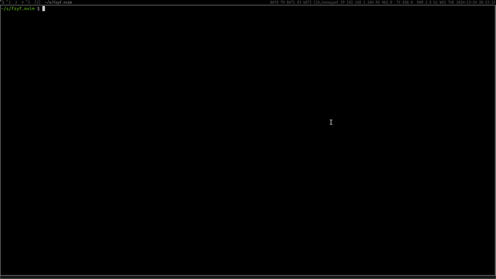

# fzyf.nvim

fast and simple as fuck neovim fuzzy finder that using fzy under the hood.



## installation

any plugin manager that you like

e.g. using [lazy.nvim](https://github.com/folke/lazy.nvim)

```lua
-- if init.lua
{
	"mishkafreddy2009/fzyf.nvim",
}

-- if plugins/fzyf.lua
return {
	"mishkafreddy2009/fzyf.nvim",
}
```

## usage

```lua
local fzyf = require("fzyf")
vim.keymap.set("n", "<leader>ff", ":Fzyf<CR>", { silent = true })
```
